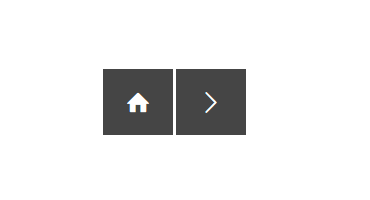

adapt-bottomNavigation
================

Navigation bar component which can contain some or all of the following buttons:
- _returnToPreviousLocation (takes you back to the previous location - not back in history, just the last routed location)
- _home (takes you back to top level menu)
- _up (takes you to the menu the next level up in the hierarchy)
- _previous (navigates directly to the previous page, if exists, without having to navigate via the menu)
- _next (navigates directly to the next page, if exists, without having to navigate via the menu)
- _sibling (1,2,3,4 etc buttons representing each sibling page)
- _close (closes the course window - only possible if the course was launched in a popup window)